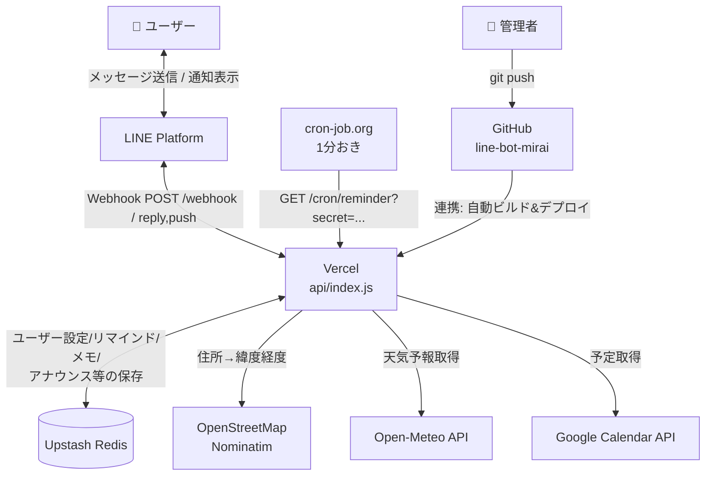
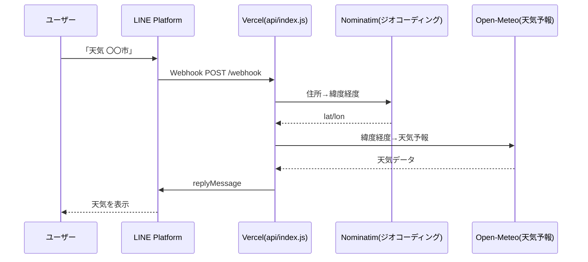
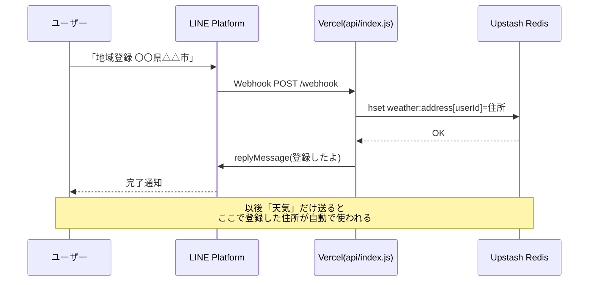
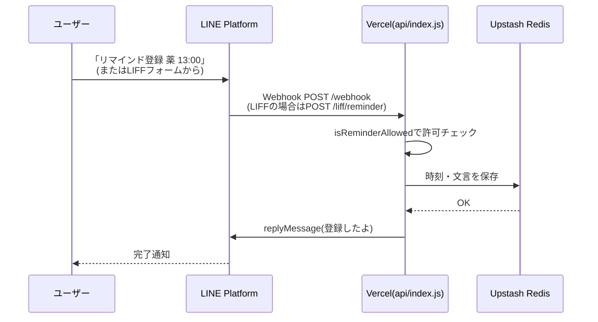
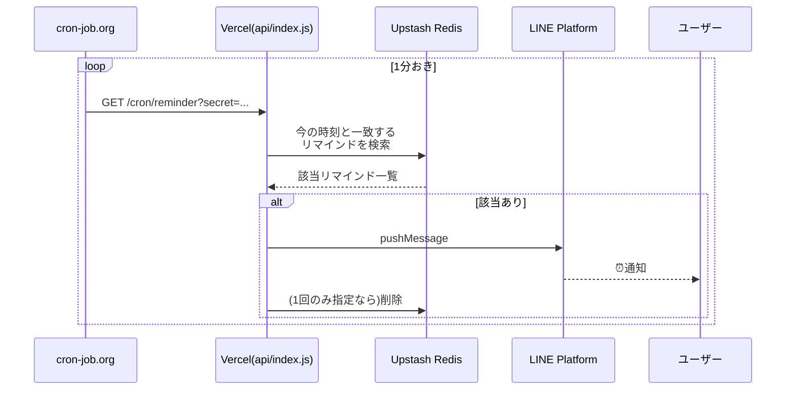
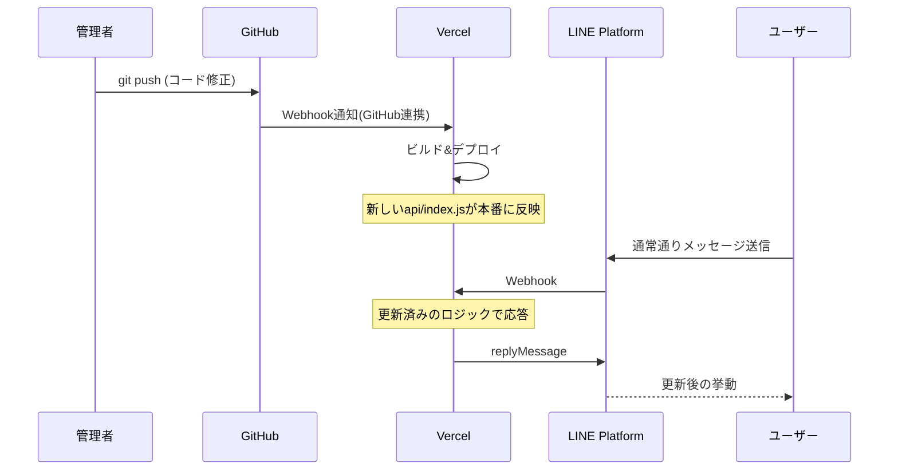

# 構成図(アーキテクチャ)

line-bot-miraiの全体構成と、主要な処理フローをmermaidで図示したもの。
コード変更で構成が変わったら、このファイルも合わせて更新する。

## 全体構成図

## ①ユーザーが天気を確認するとき

## ②ユーザーが地域設定するとき

## ③ユーザーがリマインダ設定するとき

登録と、実際に時間になって届くところは別フロー。

### 登録

### 送信(cronが駆動)

## ④管理者がツールを更新するとき

## 補足

- 天気/地域設定/リマインダー登録は、基本的に**「LINE→Vercel→Redis(必要なら外部API)→LINE」**という同じ形の処理。
- リマインダー・アナウンスの**送信タイミングだけ**、外部のcron-job.orgが`/cron/reminder`を1分おきに叩くことで駆動している(Vercel Hobbyプラン自前のCronは1日1回までのため代替手段として採用)。
- デプロイはGitHub連携なので、`git push`した瞬間にVercelが自動でビルド・反映する。
