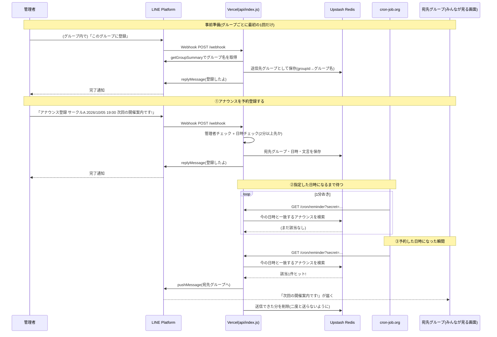

# ユースケース: グループチャットへアナウンスを送るとき

「管理者が事前にアナウンスを予約 → 指定した日時になったらcronが検知 →
宛先グループに自動で告知が届く」という一連の流れを1本の図にまとめたもの。

登場人物・仕組みの詳細は [ARCHITECTURE.md](./ARCHITECTURE.md) を参照。

## ポイント

- 「このグループに登録」は**管理者だけ**が実行できる(グループの他メンバーが誤って/勝手に登録できないよう制限)。
- アナウンス登録時、**今から2分未満の日時は登録できない**([ARCHITECTURE.md](./ARCHITECTURE.md)の補足参照)。cronのチェックタイミングを逃して永久に送信されないまま残ってしまうのを防ぐため。
- 実際に「時間になったかどうか」を判断してるのはcron-job.orgではなく**Vercel側**。cron-job.orgは1分おきに叩くだけの目覚まし役。
- 送信に成功した分だけ自動で削除される。失敗した場合は次の1分おきのチェックでまた狙われる(=取りこぼしに強い)。
